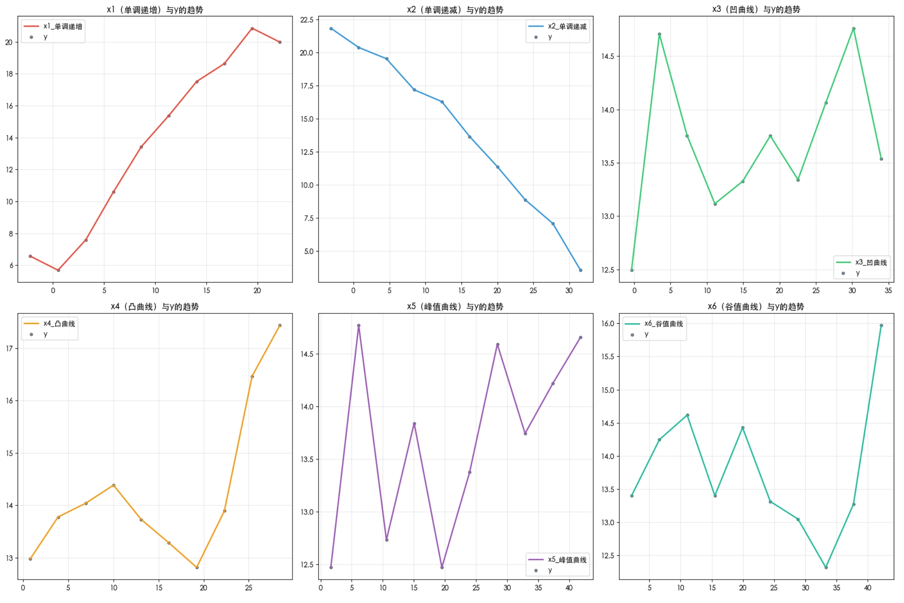
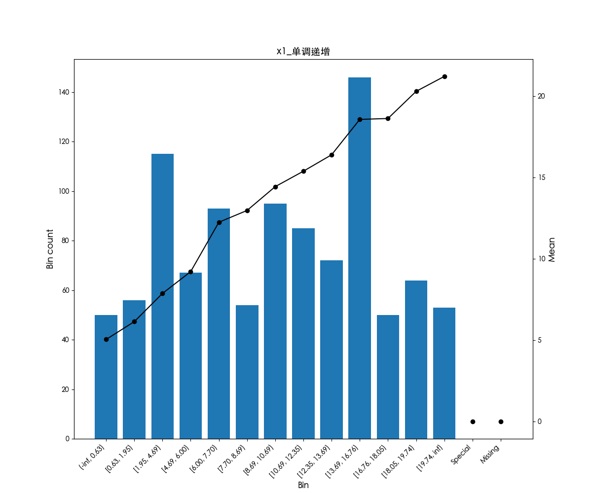
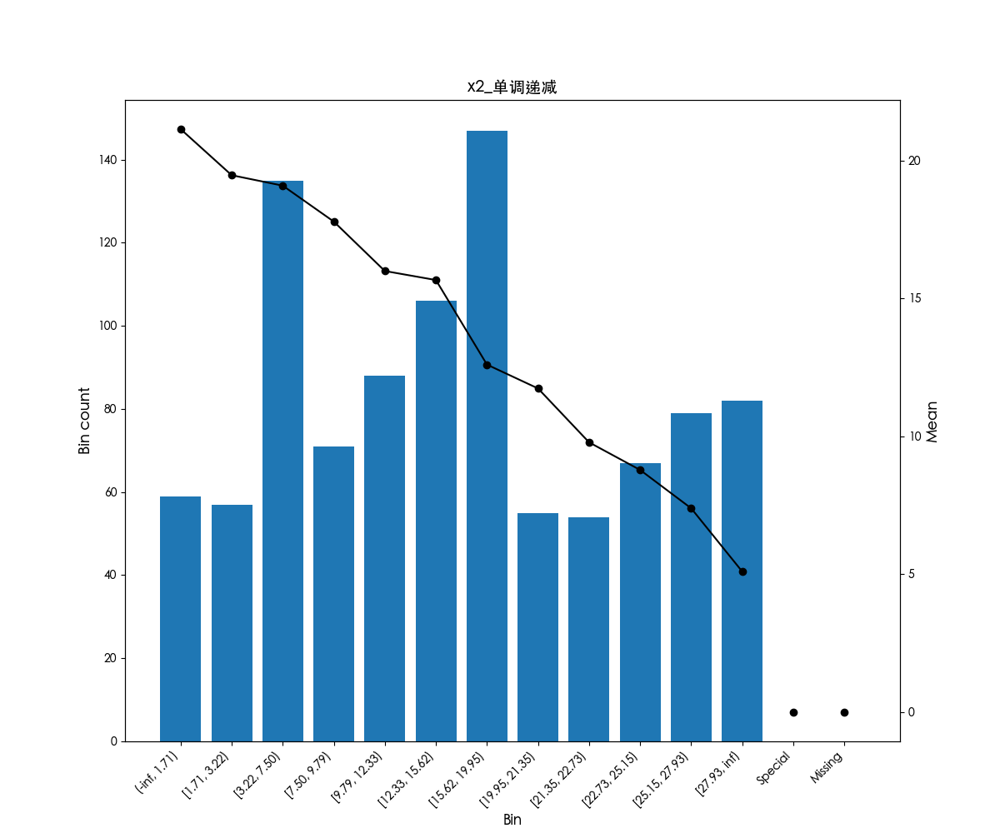
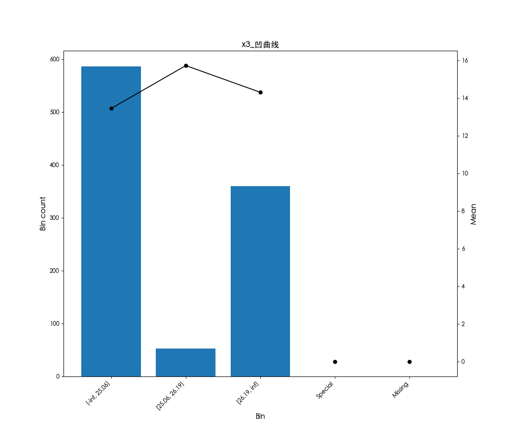
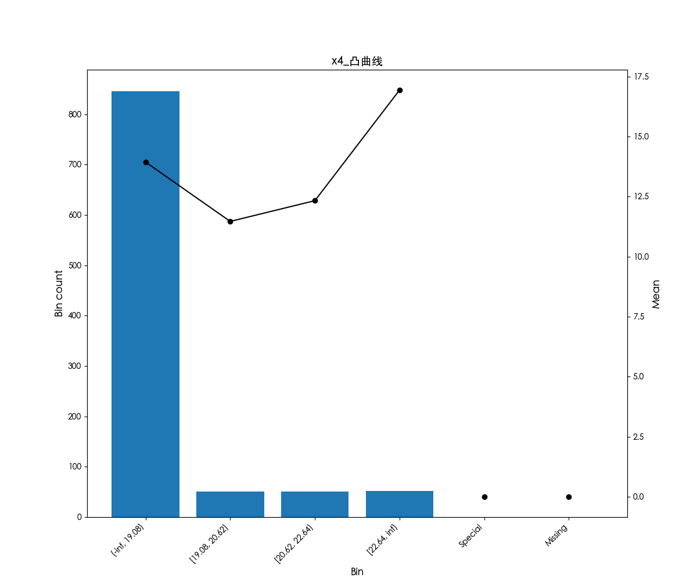
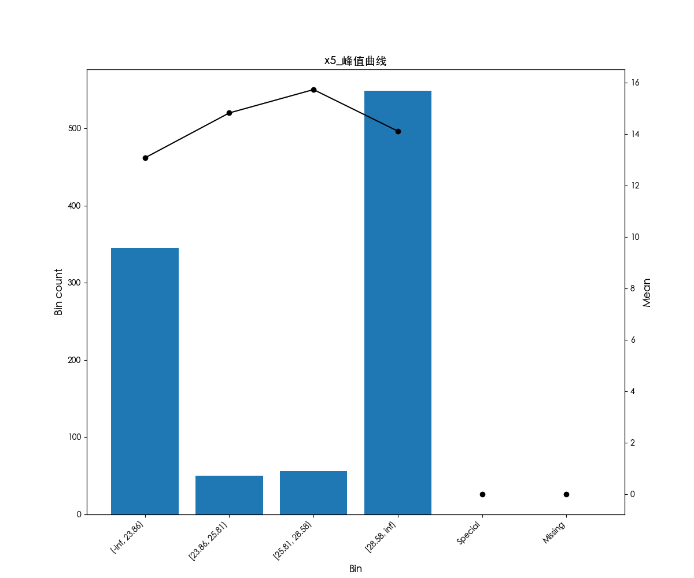
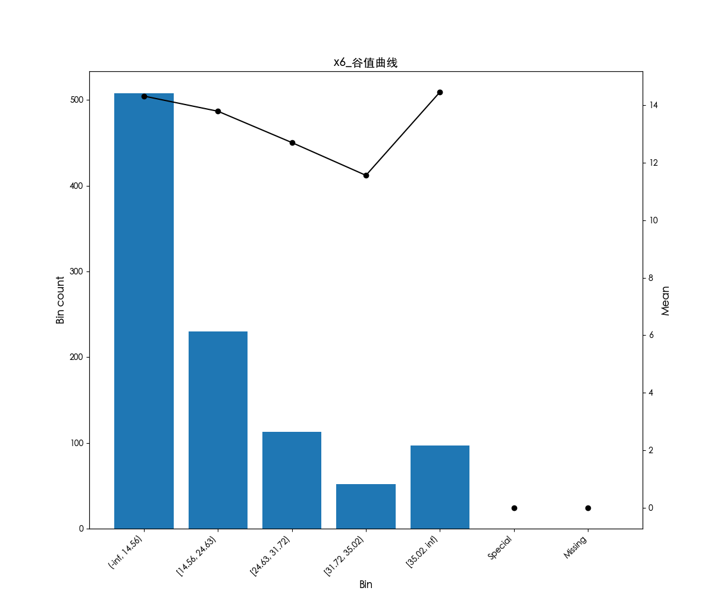
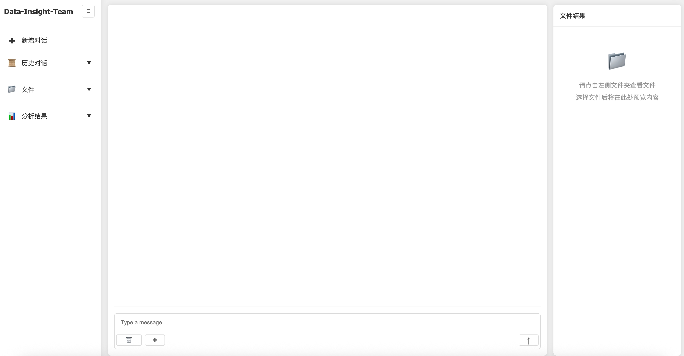

# DataInsightAgent
[![GitHub license][license-badge]][license-url]
[![Python Versions][python-badge]][pypi-url]

[license-badge]: https://img.shields.io/badge/license-Apache%202.0-green
[license-url]: https://github.com/ZhixinChang/SentimentAgent/blob/main/LICENSE

[python-badge]: https://img.shields.io/badge/python-3.13-blue
[pypi-url]: https://pypi.org/project/data_insight_agent/

A data insight agent that interacts with users using natural language to complete data science analysis and achieve data-driven decision-making.

## What can this do for you?
Data insight agent is a multi-agent framework designed to assist data analysts in conducting more professional data science analysis, improving the efficiency and quality of analysis, and achieving better data-driven business decision-making.

## Quick Start
Make sure you have followed the installation instructions.

### Example: multivariate correlation analysis
Firstly, import the relevant libraries and methods.

```python
from data_insight_agent import DataInsightTeam

base_url = "<your_base_url>"
api_key = "<your_api_key>"
model = "<your_model>"

data_insight_team = DataInsightTeam(base_url=base_url, api_key=api_key, model=model)
```

Secondly, by specifying a correlation analysis task through natural language, only one line of code is needed to complete data science analysis!

```python
task = '给定数据路径/.../DataInsightAgent/examples/correlation_analysis.xlsx，请分别分析所有指标与y的相关性，并把结果保存至/.../Downloads'
await data_insight_team.astream(content=task)
```

By observing the streaming output of the intelligent agent, we can observe that the analysis task is first sent to the supervisor, who then assigns it to the Data.analyst_team for execution. The Data.analyst completes the correlation analysis by calling advanced data science methods.

```
==================================🤖 Supervisor==================================
================================== Ai Message ==================================
Name: Supervisor
Tool Calls:
  data_analysis_team (call_onr8o5gitx983b3u57gbcen4)
 Call ID: call_onr8o5gitx983b3u57gbcen4
  Args:
    task: 分析数据集/.../DataInsightAgent/examples/correlation_analysis.xlsx中所有指标与y的相关性，并将结果保存至/.../Downloads
==================================🤖 Data_analyst==================================
================================== Ai Message ==================================
Name: Data_analyst
Tool Calls:
  data_describe (call_rt6rqf2nzegqngjdbqf08pve)
 Call ID: call_rt6rqf2nzegqngjdbqf08pve
  Args:
    data_path: /.../DataInsightAgent/examples/correlation_analysis.xlsx
================================= Tool Message =================================
Name: data_describe

数据中包含的信息如下：字段名：x1_单调递增，数据类型：float64
字段名：x2_单调递减，数据类型：float64
字段名：x3_凹曲线，数据类型：float64
字段名：x4_凸曲线，数据类型：float64
字段名：x5_峰值曲线，数据类型：float64
字段名：x6_谷值曲线，数据类型：float64
字段名：y，数据类型：float64
================================== Ai Message ==================================
Name: Data_analyst
Tool Calls:
  correlation_analysis (call_j5erzbjanxaq6unbtda8dozy)
 Call ID: call_j5erzbjanxaq6unbtda8dozy
  Args:
    data_path: /.../DataInsightAgent/examples/correlation_analysis.xlsx
    result_path: /.../Downloads
    x_monotonic_trend_list: [['x1_单调递增', '递增'], ['x2_单调递减', '递减'], ['x3_凹曲线', '凹曲线'], ['x4_凸曲线', '凸曲线'], ['x5_峰值曲线', '峰值'], ['x6_谷值曲线', '谷值']]
    y: y
================================= Tool Message =================================
Name: correlation_analysis

相关性分析完成，各指标的相关系数：
x1_单调递增和y的相关系数为0.9926065627135565
x2_单调递减和y的相关系数为-0.9942545084397609
x3_凹曲线和y的相关系数为0.37261690148715315
x4_凸曲线和y的相关系数为0.5285811557450472
x5_峰值曲线和y的相关系数为0.46358764808427816
x6_谷值曲线和y的相关系数为-0.25205234184617215
相关性趋势图已输出至IMAGE_PATHS</.../Downloads/相关趋势图_x1_单调递增.png,/.../Downloads/相关趋势图_x2_单调递减.png,/.../Downloads/相关趋势图_x3_凹曲线.png,/.../Downloads/相关趋势图_x4_凸曲线.png,/.../Downloads/相关趋势图_x5_峰值曲线.png,/.../Downloads/相关趋势图_x6_谷值曲线.png>IMAGE_PATHS
================================= Tool Message =================================
Name: DataAnalystResponseFormat

Returning structured response: text_result='相关性分析完成，各指标与y的相关系数如下：\nx1_单调递增和y的相关系数为0.9926065627135565\nx2_单调递减和y的相关系数为-0.9942545084397609\nx3_凹曲线和y的相关系数为0.37261690148715315\nx4_凸曲线和y的相关系数为0.5285811557450472\nx5_峰值曲线和y的相关系数为0.46358764808427816\nx6_谷值曲线和y的相关系数为-0.25205234184617215' file_result='/.../Downloads/相关趋势图_x1_单调递增.png,/.../Downloads/相关趋势图_x2_单调递减.png,/.../Downloads/相关趋势图_x3_凹曲线.png,/.../Downloads/相关趋势图_x4_凸曲线.png,/.../Downloads/相关趋势图_x5_峰值曲线.png,/.../Downloads/相关趋势图_x6_谷值曲线.png'
================================= Tool Message =================================
Name: data_analysis_team

Returning structured response: text_result='相关性分析完成，各指标与y的相关系数如下：\nx1_单调递增和y的相关系数为0.9926065627135565\nx2_单调递减和y的相关系数为-0.9942545084397609\nx3_凹曲线和y的相关系数为0.37261690148715315\nx4_凸曲线和y的相关系数为0.5285811557450472\nx5_峰值曲线和y的相关系数为0.46358764808427816\nx6_谷值曲线和y的相关系数为-0.25205234184617215' file_result='/.../Downloads/相关趋势图_x1_单调递增.png,/.../Downloads/相关趋势图_x2_单调递减.png,/.../Downloads/相关趋势图_x3_凹曲线.png,/.../Downloads/相关趋势图_x4_凸曲线.png,/.../Downloads/相关趋势图_x5_峰值曲线.png,/.../Downloads/相关趋势图_x6_谷值曲线.png'
==================================🤖 Supervisor==================================
相关性分析完成，各指标与y的相关系数如下：
x1_单调递增和y的相关系数为0.9926065627135565
x2_单调递减和y的相关系数为-0.9942545084397609
x3_凹曲线和y的相关系数为0.37261690148715315
x4_凸曲线和y的相关系数为0.5285811557450472
x5_峰值曲线和y的相关系数为0.46358764808427816
x6_谷值曲线和y的相关系数为-0.25205234184617215

相关趋势图已保存至：
/.../Downloads/相关趋势图_x1_单调递增.png
/.../Downloads/相关趋势图_x2_单调递减.png
/.../Downloads/相关趋势图_x3_凹曲线.png
/.../Downloads/相关趋势图_x4_凸曲线.png
/.../Downloads/相关趋势图_x5_峰值曲线.png
/.../Downloads/相关趋势图_x6_谷值曲线.png
```

The advantage of using our agent is not only the improvement of analysis efficiency, but also the enhancement of the quality of analysis results. 

In the example of correlation analysis, the six indicators represent different correlation trends, and the original manually visualized correlation trends are often difficult to meet the expected settings. Agents achieve higher quality trend visualization through built-in cutting-edge algorithm capabilities, which is crucial in business scenarios with clear trend constraints.

The original manual visualization results are as follows:



The visualization results of the agent are as follows. It can be seen that the agent accurately displays the expected trends of six indicators.





In addition to using agents for data analysis in code form, we also support interaction with agents through front-end UI interfaces to enhance the user experience.


